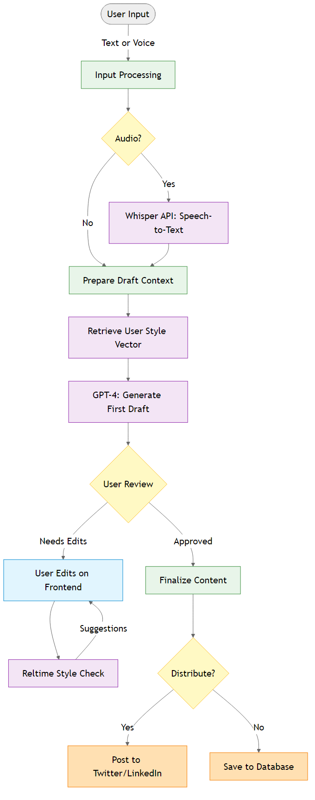
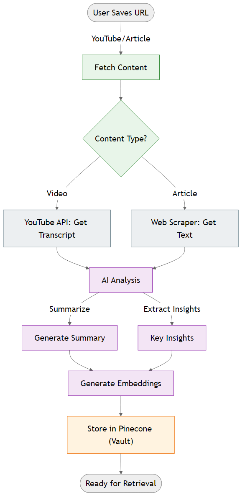
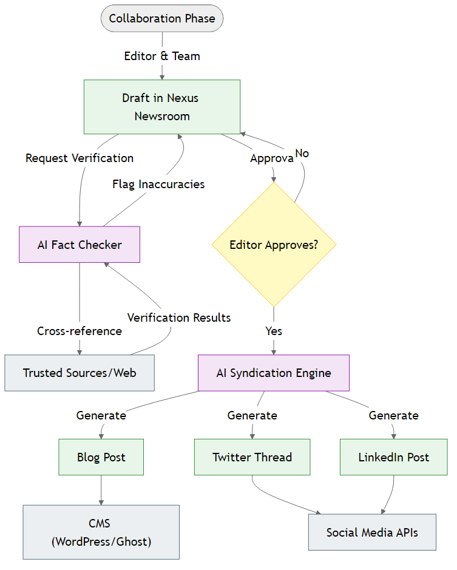

# Nexus Platform

> **From Signal to Story** — The modular AI-driven ecosystem for the complete content lifecycle.

---

## 🌟 Overview

**Nexus** is a next-generation platform designed to revolutionize how content is created, consumed, and managed professionally. It unifies the fragmented landscape of content tools into a single, cohesive ecosystem that supports creators, audiences, and enterprises alike.

By leveraging advanced AI, Nexus handles the heavy lifting of data analysis, trend forecasting, and format transformation, allowing humans to focus on what matters most: **Creativity and Strategy**.

---

## 🚀 Core Philosophy

The Nexus platform is built on the philosophy of **"From Signal to Story"**. We believe that the most impactful content starts with a market signal—a trend, a data point, or a gap in knowledge—and evolves into a polished, distributed story.

*   **AI-First**: AI is not an add-on; it's the engine.
*   **Persona-Adaptive**: The interface adapts to you, whether you're a YouTuber, a researcher, or an editor.
*   **Unified Workflow**: No more context switching between a dozen tools.

---

## 🧩 The Nexus Ecosystem

The platform consists of three integrated suites, each targeting a specific phase of the content lifecycle.

### 1. Nexus Create (Creator Suite)
*For Creators, Influencers, and Writers.*

Turn raw ideas into polished content with AI-powered assistance.

*   **Studio**: A multi-modal editor that understands text, audio, and video.
*   **Pulse**: Real-time trend forecasting to help you ride the wave before it breaks.
*   **Identity**: An AI that learns your personal brand voice and ensures consistency.

### 2. Nexus Consume (Audience Suite)
*For Knowledge Workers, Researchers, and Lifelong Learners.*

Consume information smarter, not harder.

*   **Prism**: Transform content into any format (e.g., turn a 20-page paper into a 5-minute podcast).
*   **Vault**: Your "Second Brain"—an intelligent knowledge base with semantic search.
*   **Lens**: An active browser overlay that fact-checks and detects bias in real-time.

### 3. Nexus Enterprise (Professional Suite)
*For Newsrooms, Agencies, and Corporate Teams.*

Scale your content operations with enterprise-grade tools.

*   **Source**: An investigative engine that generates timelines and maps entity relationships.
*   **Newsroom**: Editorial workflow management with automated style guide enforcement.
*   **Syndicate**: Omni-channel distribution with unified analytics.

---

## 🛠️ Technology Stack

Nexus is built with a modern, scalable, and high-performance stack.

| Component | Technology |
| :--- | :--- |
| **Frontend** | **Next.js 14** (App Router), TypeScript, Tailwind CSS, Shadcn/UI |
| **Backend** | **Node.js** (NestJS), TypeScript, Bull (Queues) |
| **AI Layer** | **LangChain**, OpenAI GPT-4, DALL-E 3, Whisper, Anthropic Claude |
| **Database** | **PostgreSQL** (Relational), **Pinecone** (Vector), **Redis** (Cache) |
| **Storage** | **AWS S3** |
| **Infrastructure** | **Docker**, **Kubernetes**, AWS |

---

## 🔮 Key Features

*   **Multi-Modal Input**: Text, audio, URL, and concept tags supported.
*   **Platform Transformation**: One-click conversion of content for Twitter, LinkedIn, Blog, etc.
*   **Real-Time Fact Checking**: Verify claims instantly as you browse the web.
*   **Semantic Search**: Find content by meaning, not just keywords.
*   **Automated Style Guides**: Enforce AP, Chicago, or custom voice guidelines automatically.
*   **Omni-Channel Publishing**: Publish to WordPress, Ghost, Social Media, and Newsletters simultaneously.

---

## 📄 License

This project is proprietary and confidential. Unauthorized copying of these files is strictly prohibited.

---

*Built with ❤️ by the Nexus Team.*
